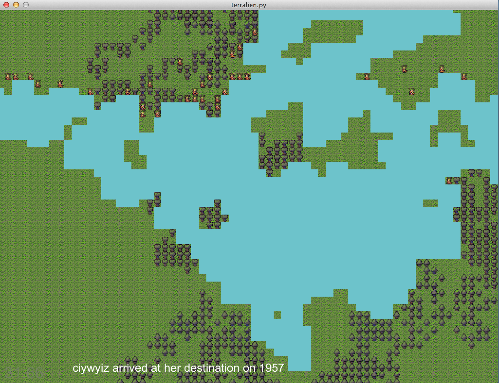
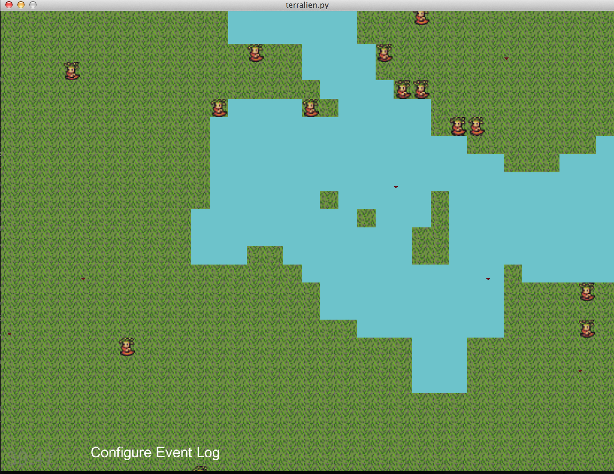
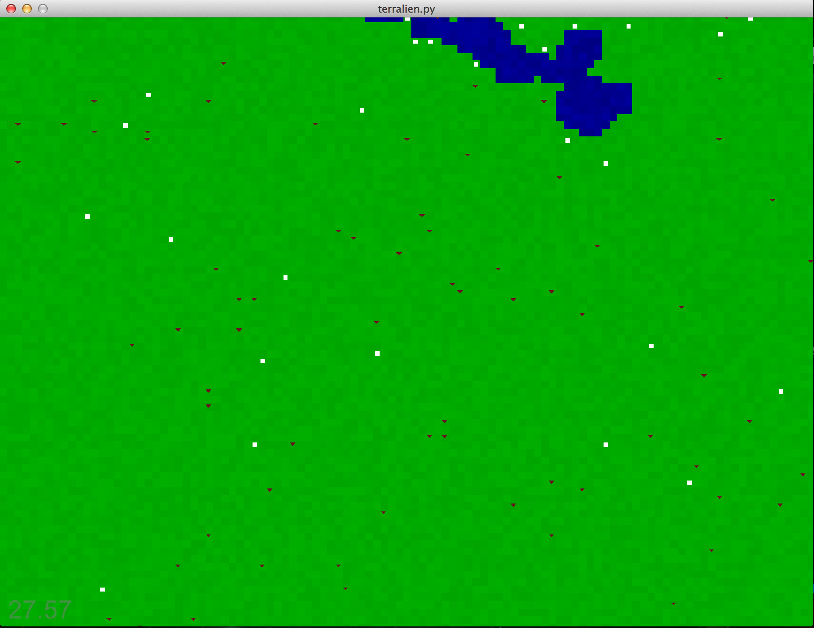

# Terralien Development

This file details the changes and experiences going through
developing this project. Frequently I lose track of what
I'm working on and where I am going. So hopefully by writing
notes I can detail what I've been learning and provide a point
to develop a more robust overview of this project in the future.

## March 10th

It's still a pretty brutal map generator, but I made it a bit more configurable
and moved some of the code out into the generators area. Forests are more consistent
and the lakes are larger. Of course, this breaks the dummy path finding game
going on right now a bit more but it's starting to look a little more interesting.

## March 9th

Set up some build processes for Terralien and Pygsty. Probably not the most important
thing but I think those things are always better to set up early because it's easy
when there isn't much work for them to do. Considering just merging the projects
again but I think I'll avoid that. Also, came across a pyglet-gui project that looks
interesting and could really jump up the level of the user interface without needing
to build it all from scratch.

For the game, added a very brutal name generator and gave actors names. Going to
work on creating an event log that will allow the characters to log what they are
thinking about, which isn't much at this point.

## March 8th, 2014

Came across some open tilesets and tried force rendering one and it work out
really well and rendered in the appropriate location pretty easily. So I'll
be looking at utilizing this for the various elements instead of the brutal
color rendering I've currently been doing. This should actually simplify code
down considerable since I won't need to manage vertex data so much but instead
should be able to just point to images.

Ok, simple animations (not in very programmatic way) Images for terrain and
actors now. Pretty cool.

## March 6th, 2014

Added some logging to pygsty to track root events, also sort of have logging working
out so that game events could be logged out but it didn't quite work. Python
default logging works a little differently than I expected so once an logger
has been created, things start mucking together more than I anticipated. At least
in a weird way. Might just not understand something, but there is definitely
a mixup going on with multiple loggers in separate modules. Will work through it.

On the cool side, making a new controller is dead simple so being able to construct
more interesting user interface elements should be a breeze with a bit more thought
on controls and elements.

## March 5th, 2014

Fixed a bad test in actors to run. Models are probably going to end up referencing each other
extensively. Maybe this isn't a bad thing now that I think about it. Actually, I
just was sleepy and being down on it. I think we are good. AI might be the weird
one out at this point since it extends model functionality. But it could be isolated
in a clean fashion in the long run.

Got some brutal trees on the map. Well, upside down triangles anyway. Fine for a start but
am starting to see some annoyances with world vs screen/render coordinates coming up
on a regular basis. I'd like to avoid a matrix for every little blip but maybe that's
the easiest way for now.

## March 3rd, 2014

Minor update but actors don't move through the water anymore so that's nice. Except
they get stuck now because I shortened the length of the path search so much.
Came up with an idea for them to move around it though by having them hold on
to their old searches to use when they need to search. So there will always be the
ability to use previous path information. Also read about graphs and waypoints to
help with the calculation performance and appearance. But that's probably a few
releases down the line.

### Goal for next update

  * All tests passing
  * Static elements on the map like some trees and plants
  * Some information to the screen like the total number of actors in it or something just to get the UI developing

## March 2nd, 2014

Characters now pick a destination and move towards it, when they get there they
pick a different location and move towards that. It is running around 30FPS with
100 characters moving about and finding paths. So not bad but not good enough.
Made some basic optimizations that sped things up but the downside is that it
seems sometimes the actors can get stuck in some circular loops. I'll need to
spend more time here, but for the time being the main objective is complete.

Looking into adding some different terrain types now.

## March 1st, 2014

Not much progress but hey, accomplished the goals. I have some characters
that move about randomly. Well, it's a white square, but they can move
any random direction. Not exactly where the code needs to lay for all this
stuff, but the controller lightly directs them and things are happening also

### Goals for next update
  * Characters pick a goal to move to some random location
  * Characters move to location
  * Upon arrival they pick a different goal and move towards that

## February 28th, 2014

Here is where things ended up at the end of last night:

So what is going on that is interesting? Basically this is rendering out
a tilemap as a single batch where each tile can have it's own color. Not
the most exciting thing on the planet, but it allows for scaling this up
to have different kinds of terrain, and also we can start putting characters
into this pasturic paradise.

### Goals for next update
  * Show a character on the map
  * Character should be able to move about randomly
