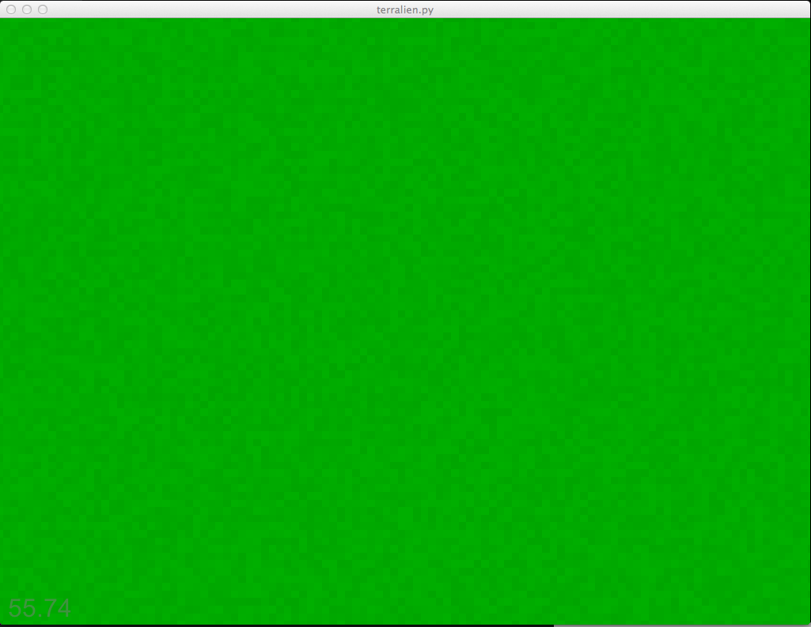
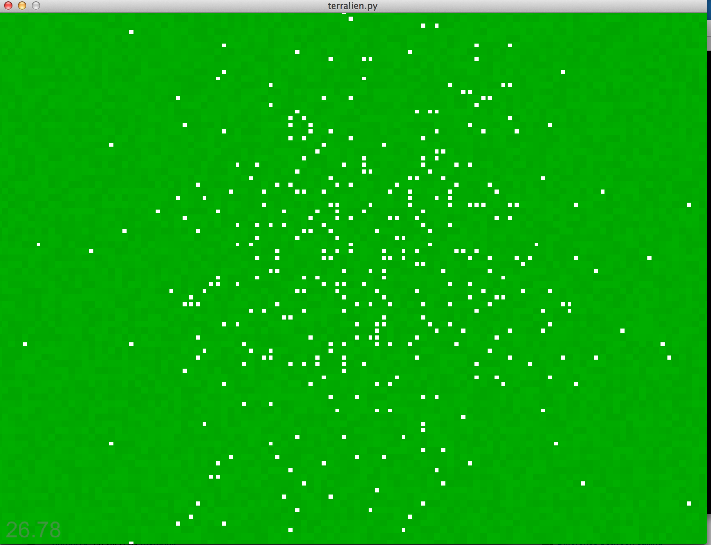

# Terralien Development

This file details the changes and experiences going through
developing this project. Frequently I lose track of what
I'm working on and where I am going. So hopefully by writing
notes I can detail what I've been learning and provide a point
to develop a more robust overview of this project in the future.

## February 28th, 2014

Here is where things ended up at the end of last night:

So what is going on that is interesting? Basically this is rendering out
a tilemap as a single batch where each tile can have it's own color. Not
the most exciting thing on the planet, but it allows for scaling this up
to have different kinds of terrain, and also we can start putting characters
into this pasturic paradise.

### Goals for next update
  * Show a character on the map
  * Character should be able to move about randomly

## March 1st, 2014

Not much progress but hey, accomplished the goals. I have some characters
that move about randomly. Well, it's a white square, but they can move
any random direction. Not exactly where the code needs to lay for all this
stuff, but the controller lightly directs them and things are happening also

### Goals for next update
  * Characters pick a goal to move to some random location
  * Characters move to location
  * Upon arrival they pick a different goal and move towards that
